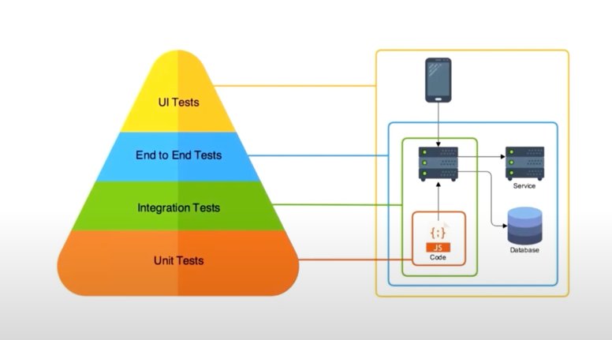
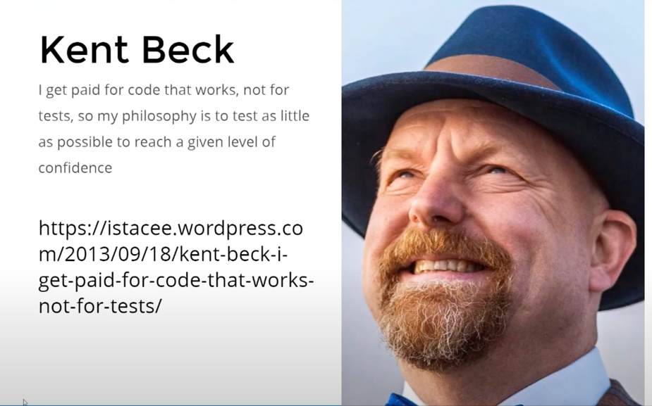
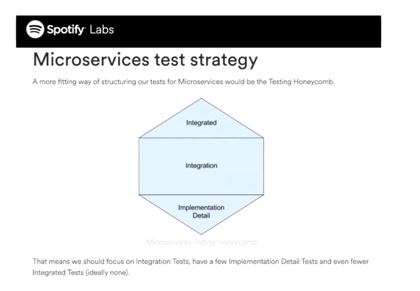

# Сценарий видео: "Пишем тесты для backend приложений — полный гайд за 10 минут"

**[0:00 - 0:30] Приветствие и введение**  

- *Йоу, йоу! Вы на канале msavin, и сегодня мы поговорим о том, зачем и как писать тесты для backend-приложений.*  
- *Мы разберем: зачем вообще тестировать код, какие инструменты использовать, и что знать для прохождения собеседований*  
- *Поехали!*

---

**[0:30 - 2:00] Блок 1: Зачем писать тесты?**  

- **Ускорение рефакторинга**: Тесты позволяют быстро проверять изменения. (FDD)
- **Удобство**: Часто бывает быстрее написать тест, который совершает запрос на эндпойнт и прогонять его одним нажатием, чем прибегать к постману или сваггеру
- **Минимизация критических багов**: Ловят ошибки до продакшена что приводит к Уверенности в своем коде  
- **Проектирование кода**: Сложность тестирования сигнализирует о проблемах с зависимостями ([Dependency Elimination](https://qualityisspeed.blogspot.com/2014/09/beyond-solid-dependency-elimination.html)).  
- **Документация кода**
---

**[2:00 - 4:00] Блок 2: Инструменты и паттерны**  

**Инструменты**:  
- [PHPUnit](https://github.com/sebastianbergmann/phpunit) — для модульных тестов.  
- [Pest](https://github.com/pestphp/pest) — лаконичный синтаксис.  
- [Codeception](https://github.com/Codeception/Codeception) — E2E и интеграционные тесты.  Надстройка над phpunit
- [Faker](https://github.com/fzaninotto/Faker) — генерация тестовых данных.  
- [Infection](https://infection.github.io/) — мутационное тестирование.  

**AAA-паттерн**:  
```php
// Arrange
$user = User::factory()->create();

// Act
$response = $this->post('/login', ['email' => $user->email, 'password' => 'password']);

// Assert
$response->assertRedirect('/dashboard');
```

---

**[4:00 - 5:30] Блок 3: Unit vs Интеграционные тесты**

- **Unit-тесты**:
    - Тестируют один компонент (метод, класс).
    - Зависимости замоканы (без БД, API).

- **Интеграционные тесты**:
    - Проверяют взаимодействие компонентов (например, с реальной БД).
    - Статья: [Integrated Tests Are a Scam](https://blog.thecodewhisperer.com/permalink/integrated-tests-are-a-scam).

https://www.youtube.com/watch?v=zrUwYBzb9zY&t=2583s (20:36)
Пирамида тестирования. Мартин Фаулер


 - аргумент писать интеграционные тесты, которые покрывают максимум код минимумом строк. Плюс мы скорее хотим быть уверены, что работает все приложение, а не отдельный его класс
e2e тесты слишком дорогие, не пишем

идеальный тест не сломается от рефакторинга - он ничего не знает о приложении, это черный ящик. камень в огород моков
иначе после глобавльного рефакторинга будет проще удалить тесты и написать их заново (у меня такое было)




---

**[5:30 - 7:00] Блок 4: Stubs vs Mocks** (на собесе в VK спрашивали)

Test doubles 

- **Stub**: Заглушка с захардкоженными методами
  ```php
  $stub = $this->createStub(UserRepository::class);
  $stub->method('find')->willReturn(new User());
  ```

- **Mock**: Конфигурирует поведение. тоже позволяет вернуть определенное значение, но без создания новых классов, и это скорее побочная фича. важно то, что на моке можно проверять поведение - например что какой-то метод был вызван ровно 1 раз ровно с указанными параметрами
  ```php
  $mock = $this->createMock(Mailer::class);
  $mock->expects($this->once())->method('send');
  ```

- Статьи:
    - [Mocks Aren't Stubs](https://martinfowler.com/articles/mocksArentStubs.html).
    - [Classical vs. Mockist Testing](https://martinfowler.com/articles/mocksArentStubs.html#ClassicalAndMockistTesting).

---

**[7:00 - 8:30] Блок 5: TDD и метрики**

**TDD**:
1. Red → 2. Green → 3. Refactor.

применим при четко выделенном домене. пример - библиотека по кодированию декодированию https://github.com/savinmikhail/encrypting . вручную проверять очень сложно. более того, каждый неправильный байт валит всю логику. легко выделить публичное API и написать сначала тесты, потом реализацию

**Метрики**:
- **Code Coverage**: Не гарантирует отсутствие багов. Яркий пример - тернарный оператор
- **Mutation Score** ([Infection](https://infection.github.io/)): "Убивайте" мутантов в коде.

---

**[8:30 - 9:50] Блок 6: Итоги и советы**
- Тесты экономят время в долгосрочной перспективе.
- Выбирайте инструменты под задачу.
- Баланс между моками и реальными зависимостями.

---

**[9:50 - 10:00] Прощание**

- *Спасибо за просмотр! Если было полезно, ставьте лайк и подписывайтесь. В комментариях напишите: с какими сложностями в тестировании сталкиваетесь вы? Обязательно отвечу. До новых встреч!*
