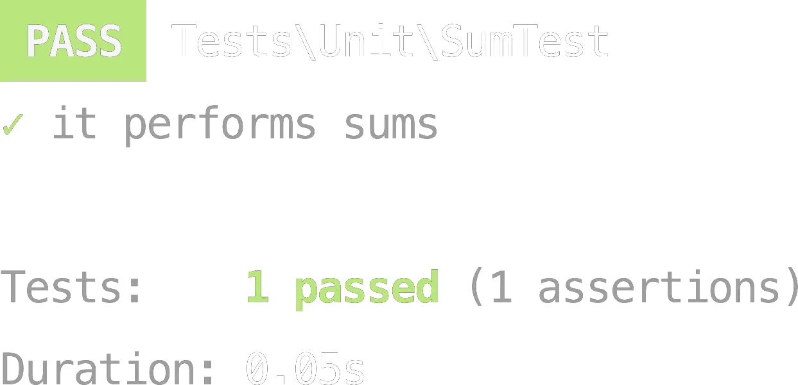

# Сценарий видео: "Пишем тесты для backend приложений — полный гайд за 10 минут"

**[0:00 - 0:30] Приветствие и введение**  

- *Йоу, йоу! Вы на канале msavin, и сегодня мы поговорим о том, зачем и как писать тесты для backend-приложений.*  
- *Мы разберем: зачем вообще тестировать код, какие инструменты использовать, и что стоит знать для прохождения собеседований*  
- *Поехали!*

---

**[0:30 - 2:00] Блок 1: Зачем писать тесты?**  
Здесь есть несколько аргументов, я расскажу их в порядке важности (для меня по крайней мере)

1. **Ускорение рефакторинга**: 
Тесты позволяют быстро проверять изменения. Есть понятие Fear driven development (разработка, движимая страхом), когда вам достался контроллер на 3к строк, 
который вызывает другие контроллеры (а я видел такое), но отрефакторить вам это запрещает вся команда, потому что можно сломать базовую функциональность, 
и тестерам надо будет делать регресс, в общем можно погробить много человеко-часов

2. **Удобство**:
Часто бывает быстрее написать тест, который совершает запрос на эндпойнт и прогонять его одним нажатием, чем прибегать к постману или сваггеру. 
Вот как в примере - по сути 4 строки кода. Наверняка вы напишете это быстрее, чем запустите postman.

```php
    public function testGetEventSettings(): void
    {
        // arrange
        $client = self::createAuthorizedClient(TestCoreUserProvider::TEST_USER1);

        // act
        $response = $client->request('GET', '/api/event_settings')->toArray(false);

        // assert
        self::assertResponseIsSuccessful();
        self::assertEquals(count(EventTypeEnum::cases()), $response['hydra:totalItems']);
    }
```
3. **Уверенность в своем коде**:
Ловят ошибки до передачи задачи в тестирование, что приводит к уверенности в своем коде.  

По крайней мере вы точно знаете что гет запрос на такой-то эндпойнт не свалится с эксепшном в самом базовом сценарии. 

А искать все баги тестами нет смысла, так как как только вы их нашли и починили, тесты на этот case имеют мало смысла. 
(если это был просто глупый баг, а не какой-то edgecase бизнес логики, который надо проверять) 

4. **Проектирование кода**: 
Сложность тестирования сигнализирует о проблемах с зависимостями 
([Dependency Elimination](https://qualityisspeed.blogspot.com/2014/09/beyond-solid-dependency-elimination.html)). 

Например возможно ваш сервис требует кучу сложных зависимостей, которые надо инстанциировать и передать. 

Если это сложно сделать в тестах, очень вероятно что класс делает все подряд. 

у меня был такой пример, когда один класс работал и с кешом, и с файловой системой, и с интерфейсов ввода вывода. 
это было очень сложно тестировать, так как приходилось мокать все вокруг. 
в итоге я разделил этот класс условно на 3, один доставал что надо из файловой системы, 
другой умел писать в консоль, третий оставил в себе основную логику вместе с кешом. 

Соответственно теперь для класса с файловой системой я мог использовать виртуальную, 
а для класса с основной логикой я мог просто передавать какие-то ДТОшки, вместо того чтоб создавать виртуальные файлы и наполнять их какими-то данными

5. **Документация кода**:
Это одинаково актуально как для АПИ приложения - то есть для эндпойнтов, так и для АПИ классов - например для библиотек. 
В идеальном мире у каждого проекта несомненно написана документация в виде ридми или сваггера и она всегда актуальна, но в нашем мире не всегда так. 
и следющее место куда можно обратиться за примерами как исползовать АПИ системы - это ее тесты. 
На последнем рабочем проекте, мне было настолько непонятно как что работает, что я потратил первые дня 2 чтоб описать тестами существующий функционал. 
Благодаря чему на 3й день я смог уже писать новые фичи

---

**[2:00 - 4:00] Блок 2: Инструменты и паттерны**  

**Инструменты**:  
1. [PHPUnit](https://github.com/sebastianbergmann/phpunit) — самый известный тестовый фреймворк, аналог JUnit в java.   
Пример теста на экране
```php
final class GreeterTest extends TestCase
{
    public function testGreetsWithName(): void
    {
        $greeter = new Greeter;

        $greeting = $greeter->greet('Alice');

        $this->assertSame('Hello, Alice!', $greeting);
    }
}
```

2. [Faker](https://github.com/fzaninotto/Faker) — генерация тестовых данных.  
Пример
```php
<?php
// use the factory to create a Faker\Generator instance
$faker = Faker\Factory::create();

// generate data by accessing properties
echo $faker->name;
  // 'Lucy Cechtelar';
echo $faker->address;
  // "426 Jordy Lodge
  // Cartwrightshire, SC 88120-6700"
echo $faker->text;
  // Dolores sit sint laboriosam dolorem culpa et autem. Beatae nam sunt fugit
  // et sit et mollitia sed.
  // Fuga deserunt tempora facere magni omnis. Omnis quia temporibus laudantium
  // sit minima sint.
```
Библиотека предоставляет очень богатое АПИ, сгенерировать можно чуть ли не все на свете
например что-то такое
```php
<?php

// Generates a random AVS13/AHV13 social security number
echo $faker->avs13; // "756.1234.5678.97"
```

Плюс можно генерировать на разных языках

3. [Sendstruck](https://github.com/zenstruck/foundry) - фабрики (используются в symfony, в laravel например свой пакет)
выглядит как
```php
<?php

declare(strict_types=1);

namespace App\Tests\Factory;

use DateTimeImmutable;
use Zenstruck\Foundry\Persistence\PersistentProxyObjectFactory;

/**
 * @extends PersistentProxyObjectFactory<Artifact>
 */
class ArtifactFactory extends PersistentProxyObjectFactory
{
    public static function class(): string
    {
        return Artifact::class;
    }

    protected function defaults(): array|callable
    {
        return [
            'name' => self::faker()->slug(),
            'type' => self::faker()->randomElement([Artifact::TYPE_FOLDER, Artifact::TYPE_ASSET]),
            'createdAt' => DateTimeImmutable::createFromMutable(self::faker()->dateTime()),
            'updatedAt' => DateTimeImmutable::createFromMutable(self::faker()->dateTime()),
        ];
    }
}

```
и используется как ArtifactFactory::createOne(); например

4. [Fixtures](https://github.com/doctrine/data-fixtures) - фикстуры (для доктрины). в laravel используются seeder'ы
выглядит как
```php
<?php

namespace MyDataFixtures;

use Doctrine\Common\DataFixtures\FixtureInterface;
use Doctrine\Persistence\ObjectManager;

class UserDataLoader implements FixtureInterface
{
    public function load(ObjectManager $manager): void
    {
        $user = new User();
        $user->setUsername('jwage');
        $user->setPassword('test');

        $manager->persist($user);
        $manager->flush();
    }
}
```

И запускается консольной командой

5. [Infection](https://infection.github.io/) — мутационное тестирование.  
6. [Pest](https://github.com/pestphp/pest) — тестовый фреймворк, аналогичный PHPUnit, но им я не пользовался
пример кода
```php
it('performs sums', function () {
   $result = sum(1, 2);
 
   expect($result)->toBe(3);
});
```



7. [Codeception](https://github.com/Codeception/Codeception) 
Надстройка над phpunit использующая синтаксис для BDD. на мой взгляд стоит использовать только если у вас server side rendering.
Пример кода
```php
$I->amOnPage('/');
$I->click('Pages');
$I->click('New');
$I->see('New Page');
$I->submitForm('form#new_page', ['title' => 'Movie Review']);
$I->see('page created'); // notice generated
$I->see('Movie Review','h1'); // head of page of is our title
$I->seeInCurrentUrl('pages/movie-review'); // slug is generated
$I->seeInDatabase('pages', ['title' => 'Movie Review']); // data is stored in database
```

В некоторых примерах вы могли видеть повторяющиеся комментарии вида //arrange //act //assert. Это так называемый triple A pattern, помогающий явно структурировать тесты, и тестировать в одном методе только один кейс, не все подряд
**AAA-паттерн**:  
```php
// Arrange
$user = User::factory()->create();

// Act
$response = $this->post('/login', ['email' => $user->email, 'password' => 'password']);

// Assert
$response->assertRedirect('/dashboard');
```

Здесь же хочу сказать, что использование `if` конструкций в вашем тесте как правило говоритт о том, что он плохо написан
`foreach` же конструкцию использовать можно (или как альтернативу им всякие array_map) 

```php
$updatedAt = array_map(
          static fn(array $edge): string => $edge['updatedAt'],
          $response['hydra:member'],
      );

self::assertSame(['2024-12-13T10:00:00+00:00', '2024-12-12T10:00:00+00:00'], $updatedAt);
```


---

**[4:00 - 5:30] Блок 3: Unit vs Интеграционные тесты**

Как вы уже могли заметить по примерам кода, есть разные уровни тестов

1. Есть тесты которые просто вызывают функцию или метод - это Unit тесты, 
- Тестируют один компонент (метод, класс).
- Нет обращений к другим подсистемам (Файловой системе, БД, кеш, АПИ других сервисов)

2. Есть тесты, для которых нужны fixtures/factories - то есть какое-то состояние базы данных, которое после выполнения целевого действия должно измениться. 
Возможно даже совершают запрос на endpoint вашего приложения. 
Это интеграционные тесты, так как будет проверятся и взаимодействие компонентов (самое частое - бд)

3. Есть тесты которые создают состояние базы данных без "грязных хаков" в виде fixture/factories, а в виде тех же самых запросов к апи. то есть внутри одного теста вы условно и добавляете товары в корзину и совершаете заказ и оплачиваете его. это e2e тесты (end to end)

4. Есть тесты, которые как бы ходят по User Interface вашего приложения, нажимают кнопки, читают заголовки и тп (пример из сodeception) - это UI тесты

Сложность этих тестов растет соответственно, а значит и  отрабатывать они будут дольше, больше съедать памяти 

Эта мысль была впервые сформулирована Kent Beck'ом еще до 2000х. Kent Beck изобрел tdd, был автором Extreme Programming, Agile Manifest.  В общем дяденька на уровне Martin'a Fauler'a

Собственно сама Пирамида тестирования выглядит следующим образом


Идея здесь в том, чтобы как можно меньше было дорогих тестов (на которых еще и сложно протестить edge cases каких-либо участков логики), и побольше Unit тестов

Однако времена изменились, и отношение самого Kent Beck'a к тестированию тоже:

 
Здесь он говорит, что ему платят за написание кода, а не тестов, 
поэтому он предпочитает писать те тесты, 
которые покроют максимум строк кода при минимуме строк теста - а это интеграционные

Плюс мы скорее хотим быть уверены, что работает все приложение, а не отдельный его класс
Ведь ошибка может закрасться на уровень Application/Infrastructure
Вдобавок интеграционные тесты, которые именно совершают запрос на endpoint наиболее устойчивы к рефакторингу - они работают с системой как с черным ящиком, 
поэтому если вы переименовали класс / метод, изменили число аргументов или еще что-то - это никак не скажется на тесте, 
и это хорошо, потому что поддерживать кроме кода еще и тесты бывает грустно, 
и порой я был свидетелем как тесты после рефакторинга кода приходили в такую негодность что их просто выкидывали
это большой камень в огород Mockist testing, о чем мы поговорим далее

Однако из-за того что интеграционные тесты тестируют взаимодействие буквально сотен классов, вы никогда не покроете все test cases: здесь статья на эту тему
[Integrated Tests Are a Scam](https://blog.thecodewhisperer.com/permalink/integrated-tests-are-a-scam).


---

**[5:30 - 7:00] Блок 4: Stubs vs Mocks** 
Мы затронули mock'и. часто на собесах спрашивают отличие Stub vs Mock (есть даже статья на эту тему от Мартина Фаулера) [Mocks Aren't Stubs](https://martinfowler.com/articles/mocksArentStubs.html)
Начнем с того, что и Моки и Стабы лишь 2 из 5  Test doubles  выделенных Gerard Meszaros в его книге 2009 года xUnit Test Patterns Refactoring Test Code

1. Dummy - Болванка. Используется просто чтоб заполнить параметр метода/функции
2. Fake - Рабочая мплементация контракта, которую проще использовать в тестах и которую вы не потащите в продакшн. Самый яркий пример - InMemoryRepository.
```php
final class InMemoryLectureTimingRepository extends LectureTimingRepository
{
    /**
     * @var array<non-empty-string, LectureTiming>
     */
    private array $lectureTimings = [];

    public function find(Uuid $lectureId): ?LectureTiming
    {
        return $this->lectureTimings[$lectureId->toString()] ?? null;
    }

    public function save(LectureTiming $lectureTiming): void
    {
        $this->lectureTimings[$lectureTiming->lectureId->toString()] = $lectureTiming;
    }
}
```
3. Stub - Рабочая мплементация контракта, которая возвращает предопределенные (захардкоженные) ответы. полезно для тестирования сторонних АПИ, чтобы внутри теста не совершать запросов (это долго и не надежно)
```php
final class CoreStorageServiceStub extends CoreStorageService
{
    public function getFile(string $id, ?string $accessToken = null, bool $fromCache = true): CommonServiceResultDTO
    {
        $fileData = [
            'id' => $id,
            'mimeType' => 'image/jpeg',
            'size' => 1024,
            'width' => 1920,
            'height' => 1080,
            'url' => 'https://storage.domain.com/path/to/file.jpg',
            'bucket' => 's3?',
            'path' => 'path/to/file.jpg',
            'public' => true,
        ];

        $result = new CommonServiceResultDTO();
        $result->success = true;
        $result->data = CoreFileDTO::createFromArray($fileData);

        return $result;
    }
}

```
4. Spies - Это как Fake, только кроме имплементации контракта он еще и сохраняет в себе какую-то информацию о своей работе. 
Например у InMemoryLogger можно вызвать getLogs() чтобы увидеть, какие логи он писал. или у InMemoryMailer узнать сколько писем было отправлено
```php
<?php

declare(strict_types=1);

namespace App\Tests\Spy;

use Psr\Log\LoggerInterface;
use Psr\Log\LogLevel;
use Stringable;

/**
 * @see https://martinfowler.com/articles/mocksArentStubs.html
 */
final class InMemoryLogger implements LoggerInterface
{
    private array $logs = [];

    public function emergency(Stringable|string $message, array $context = []): void
    {
        $this->log(LogLevel::EMERGENCY, $message, $context);
    }

    public function alert(Stringable|string $message, array $context = []): void
    {
        $this->log(LogLevel::EMERGENCY, $message, $context);
    }

    public function critical(Stringable|string $message, array $context = []): void
    {
        $this->log(LogLevel::EMERGENCY, $message, $context);
    }

    public function error(Stringable|string $message, array $context = []): void
    {
        $this->log(LogLevel::EMERGENCY, $message, $context);
    }

    public function warning(Stringable|string $message, array $context = []): void
    {
        $this->log(LogLevel::EMERGENCY, $message, $context);
    }

    public function notice(Stringable|string $message, array $context = []): void
    {
        $this->log(LogLevel::EMERGENCY, $message, $context);
    }

    public function info(Stringable|string $message, array $context = []): void
    {
        $this->log(LogLevel::EMERGENCY, $message, $context);
    }

    public function debug(Stringable|string $message, array $context = []): void
    {
        $this->log(LogLevel::EMERGENCY, $message, $context);
    }

    public function log($level, Stringable|string $message, array $context = []): void
    {
        $this->logs[] = ['message' => $message, 'level' => $level, 'context' => $context];
    }

    public function getLogs(): array
    {
        return $this->logs;
    }
}

```
5. Mocks - Стоят особняком, так как это объекты, о поведении которых можно делать assert'ы. например что метод `send` был вызван ровно один раз именно с этими параметрами.
  ```php
    // arrange
    $mock = $this->createMock(Mailer::class);
    $service = new Service($mock);
    
    //assert
    $mock->expects($this->once())->method('send')->willReceive('test@email.com', '<body>Hello</body>')->willReturn(true);
    
    // act
    $service->handle('test@email.com', '<body>Hello</body>');
  ```

То есть моки сильно отличаются от других 4х Test Doubles тем, что они проверяют поведение объектов, а не их состояние.
И если чем Моки и похожи на Стабы, так только тем, что можно создать мок, сказать что он должен возвращать, и подсунуть его как Стаб. но это не основная его фича.

Таким образом и подход к написанию тестов делиться на 2 школы: классическую и мокистскую, где классики проверяют состояние системы после выполнение целевого действия, а мокисты проверяют поведение системы ВО ВРЕМЯ выполнения целевого действия. Мне лично (да и Фаулеру) нравится первый подход, так как такие тесты кажутся менее хрупкими, и позволяют писать тесты ничего не знаю о внутреннем устройстве системы

[Classical vs. Mockist Testing](https://martinfowler.com/articles/mocksArentStubs.html#ClassicalAndMockistTesting).

---

**[7:00 - 8:30] Блок 5: TDD и метрики**

**TDD**:
1. Red → 2. Green → 3. Refactor.

применим при четко выделенном домене. пример - библиотека по кодированию декодированию https://github.com/savinmikhail/encrypting . вручную проверять очень сложно. более того, каждый неправильный байт валит всю логику. легко выделить публичное API и написать сначала тесты, потом реализацию

**Метрики**:
- **Code Coverage**: Не гарантирует отсутствие багов. Яркий пример - тернарный оператор
- **Mutation Score** ([Infection](https://infection.github.io/)): "Убивайте" мутантов в коде.

---

**[8:30 - 9:50] Блок 6: Итоги и советы**
- Тесты экономят время в долгосрочной перспективе.
- Лучше писать интеграционные тесты вида "совершить запрос на endpoint, получить ответ"
- Лучше писать Stub/Spy, чем Mock
- Не доверяйте покрытию строк, доверяйте MSI
---

**[9:50 - 10:00] Прощание**

- *Спасибо за просмотр! Если было полезно, ставьте лайк и подписывайтесь. В комментариях напишите: с какими сложностями в тестировании сталкиваетесь вы? Обязательно отвечу. До новых встреч!*

https://www.youtube.com/watch?v=zrUwYBzb9zY&t=2583s (20:36)
